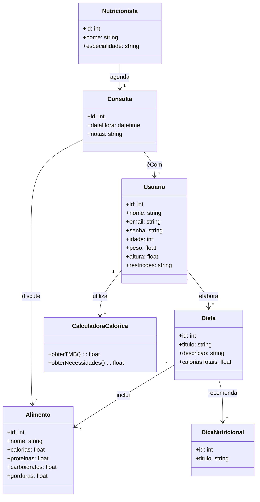

# Diagrama de Classes – Sistema Nutricional

```mermaid

classDiagram
    class Usuario {
        +id: int
        +nome: string
        +email: string
        +senha: string
        +idade: int
        +peso: float
        +altura: float
        +restricoes: string
    }

    class Dieta {
        +id: int
        +titulo: string
        +descricao: string
        +caloriasTotais: float
    }

    class Alimento {
        +id: int
        +nome: string
        +calorias: float
        +proteinas: float
        +carboidratos: float
        +gorduras: float
    }

    class CalculadoraCalorica {
        +obterTMB(): float
        +obterNecessidades(): float
    }

    class DicaNutricional {
        +id: int
        +titulo: string
    }

    class Nutricionista {
        +id: int
        +nome: string
        +especialidade: string
    }

    class Consulta {
        +id: int
        +dataHora: datetime
        +notas: string
    }

    %% RELACIONAMENTOS
    Usuario "1" --> "1" CalculadoraCalorica : utiliza
    Usuario "1" --> "*" Dieta : elabora
    Dieta "*" --> "*" Alimento : inclui
    Dieta --> "*" DicaNutricional : recomenda
    Nutricionista --> "1" Consulta : agenda
    Consulta --> "1" Usuario : éCom
    Consulta --> "*" Alimento : discute
```
